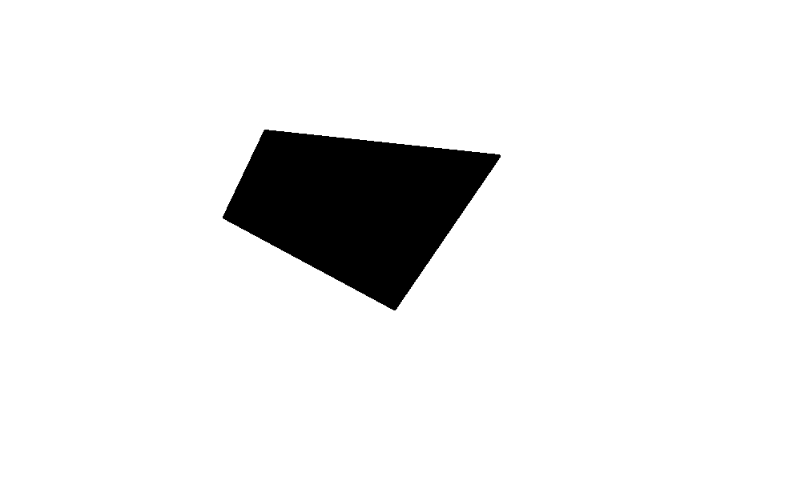
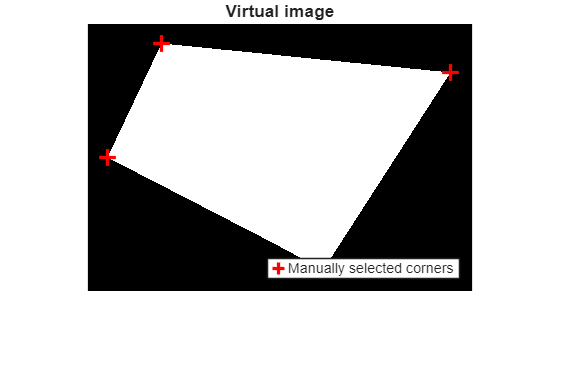
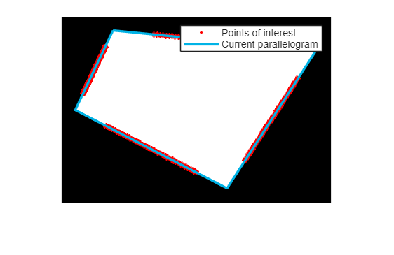
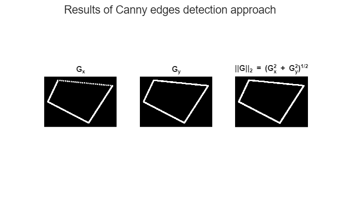
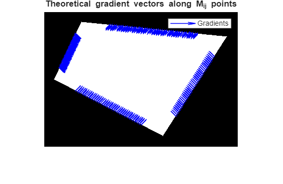
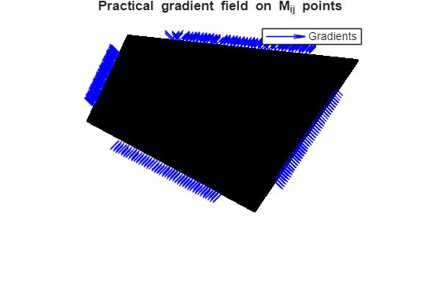
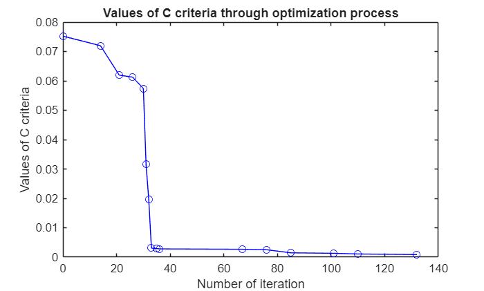
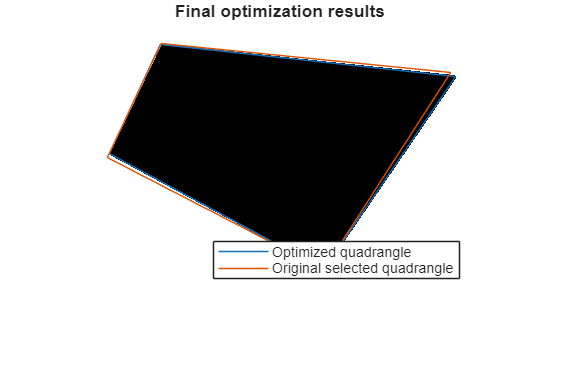

<a id="TMP_7432"></a>

# Detailed method of quadrangle detection
<!-- Begin Toc -->

## Table of Contents
&emsp;[Introduction](#TMP_0f6c)
 
&emsp;[Step 1: Load data](#TMP_0821)
 
&emsp;[Step 2: Compute theoretical gradient](#TMP_02a3)
 
&emsp;&emsp;[1. Create a virtual image](#TMP_3cdf)
 
&emsp;&emsp;[2. Find points of interest](#TMP_0218)
 
&emsp;&emsp;[3. Compute gradient on the virtual image](#TMP_4393)
 
&emsp;[Step 3 : Compute practical gradient](#TMP_738f)
 
&emsp;[Step 4 : Optimize corner position minimizing $C$](#TMP_6f7d)
 
&emsp;&emsp;[1. Definition of $C$ criterion and optimization strategy](#TMP_6d38)
 
&emsp;&emsp;[2. Results and discussion](#TMP_11f4)
 
&emsp;[Conclusion](#TMP_9353)
 
<!-- End Toc -->
<a id="TMP_0f6c"></a>

# Introduction

This report describes a method for detecting and refining the positions of quadrangle corners in an image or video sequence. To simplify the explanation, we demonstrate the method using a synthetic black\-and\-white quadrangle image. When applied to a video, this process is iterated across successive frames.


The approach is based on the computation of theoretical and practical gradients. The theoretical gradient is obtained from a virtual (synthetic) image constructed using the current corner positions, while the practical gradient is computed from the real image. These two gradients are then compared to define an optimization criterion $C$ that is minimized to refine the corner locations. All relevant formulas and implementation steps are detailed below. 

<a id="TMP_0821"></a>

# Step 1: Load data

We work on a simple black\-and\-white quadrangle image available in the repository at `Data/quadrangle.png`.

```matlab
% Load example image
close all
clear
addpath("Code\")% Import code files

image = imread("Data/quadrangle.png"); % Original image
imshow(image)
```



First, we manually select the corners to be optimized. In a video, this manual step is necessary only for the first frame as subsequent frames can reuse the previously estimated corner positions as initialization.


The function `manual_corner_selection` allows users to click on corners directly in the image. The order of selection must remain consistent, as it defines the sequence of segments between corners. Please be aware that you should keep an order to your selection as the algorithm record it as $P_1 ,~P_2 ,~P_3 \;\textrm{and}\;P_4$ so that the first segment is $[P_1 P_2 ]$ (etc.).


Alternatively, pre\-selected corner positions can be used as shown below:

```matlab
% corners = manual_corner_selection(image); % select it yourself
% OR pre-selected positions :
corners = [139    168    365    253; 243 533 406 189]
```

```matlabTextOutput
corners = 2x4
   139   168   365   253
   243   533   406   189

```

<a id="TMP_02a3"></a>

# Step 2: Compute theoretical gradient
<a id="TMP_3cdf"></a>

## 1. Create a virtual image

We first crop the image around the initial corner positions to reduce computational cost. The cropped (reframed) image will also be used later for computing the practical gradient.

```matlab
% Reframe for computation optimization
ymin = max(min(corners(1,1),corners(1,2))-20, 1);
ymax = min(max(corners(1,3),corners(1,4))+20, size(image, 1));
xmin = max(min(corners(2,1),corners(2,4))-20, 1);
xmax = min(max(corners(2,2),corners(2,3))+20, size(image, 2));
frame = image(ymin:ymax, xmin:xmax, :);
% Update corner positions to reframed image
corners(1,:) = corners(1,:)-ymin;
corners(2,:) = corners(2,:)-xmin;
```

Then, we create a virtual binary image composed of 0s and 1s, where pixels inside the quadrangle are 1 and others are 0. This step helps remove noise that could distort the gradient computation. The virtual image is generated with the function `compute_virtual_image.`

```matlab
% Create a virtual image for theoretical gradient computation
virtual_image = compute_virtual_image(frame(:,:,1), corners(2,:), corners(1,:));

% Plot it
figure, imshow(virtual_image);
hold on
plot(corners(2,:),corners(1,:),"+", "Color","red", 'LineWidth',2, 'MarkerSize',10)
legend("Manually selected corners", "Location","southeast")
title("Virtual image")
```


<a id="TMP_0218"></a>

## 2. Find points of interest

Next, we define a field of points of interest $M_{i,j}$ distributed along the quadrangle’s edge $[P_i ,P_j ]$. These points are used to compare theoretical and practical gradients and to compute the optimization criterion $C$. They are defined by:

 $$ \begin{array}{l} M_{i,j}^{u,v} =\frac{P_j +P_i }{2}+p\frac{u}{2U}(P_j -P_i )+vL\left\lbrack \frac{P_j -P_i }{\|P_j -P_i {\|}_2 }{\left.\right\rbrack }^{\perp } \right.\newline  \end{array} $$ 

Parameters include:

-  $U$: number of points along half the segment length 
-  $V$: number of points along half the segment width 
-  $p$: proportion of the segment considered 
-  $L$: spacing between rows along the width 

The positions are generated using  `compute_Mij_positions.` Below are represented the $M_{i,j}$ points along the different segments of the quadrangle.


Note that according to the chosen parameters there are : $(1+2U)(1+2V)=1+2U+2V+4UV=1+40+4+160=205$ points for each segment.

```matlab
% Mij position parameters
U = 20; % Number of point alongside the length of the segment
V = 2; % Number of point alongside the width of the segment
p = 0.6; % Segment proportion considered
L = 1; % Distance between each row alongside the width of the segment

Mij = compute_Mij_positions(U,V,p,L,corners);

% Show the field
show_Mij(Mij, virtual_image, corners);
```


<a id="TMP_4393"></a>

## 3. Compute gradient on the virtual image

We compute an approximate theoretical gradient using a Canny edge detection approach. This involves applying a 2D Gaussian filter to smooth the image before computing the x and y gradient components by convolution:

 $$ \begin{array}{l} H_x (x,y)=-xe^{-\frac{x^2 +y^2 }{2\sigma^2 }} \newline H_y (x,y)=-ye^{-\frac{x^2 +y^2 }{2\sigma^2 }}  \end{array} $$ 

 $$ G={\left(\begin{array}{cc} G_x  & G_y  \end{array}\right)}^{\perp } ={\left(\begin{array}{cc} I(x,y)*H_x (x,y) & I(x,y)*H_y (x,y) \end{array}\right)}^{\perp } $$ 

With $x,y\in [-mesh;mesh]$ for $mesh$ and $\sigma$ chosen parameters. This is done with the function `compute_gradient` which take an image, $mesh$ and $\sigma$ as inputs.


For RGB images, the mean across color channels is used.

```matlab
% Gradient computation parameters
sigma = 2;
mesh = 4;

theoretical_gradient = compute_gradient(virtual_image,sigma,mesh);

% Show gradient components
figure;
subplot(1,3,1)
imshow(abs(theoretical_gradient(:,:,1)))
title("G_x")
subplot(1,3,2)
imshow(abs(theoretical_gradient(:,:,2)))
title("G_y")
subplot(1,3,3)
squared_theoretical_gradient = theoretical_gradient.^2;
edges = sqrt(squared_theoretical_gradient(:,:,1) + squared_theoretical_gradient(:,:,2));
imshow(edges)
title("||G||_2 = (G_x^2 + G_y^2)^{1/2}");
sgtitle("Results of Canny edges detection approach");
```



Below is the plot og the theoretical gradient field on $M_{i,j}$ points. We multiplied by 10 the gradient vectors so they are more noticeable. Note that the resulting gradient vectors are almost perpendicular to the quadrangle edges, which confirms a correct gradient computation.

```matlab
% Show gradient vectors on Mijs
show_gradient(virtual_image,theoretical_gradient, Mij);
title("Theoretical gradient vectors along M_{ij} points")
```


<a id="TMP_738f"></a>

# Step 3 : Compute practical gradient

We apply the same Canny\-based approach to compute the practical (actual) gradient from the cropped real image. Because the quadrangle is black on a white background, gradient directions are opposite to the theoretical ones. However, this does not affect the optimization since the criterion $C$ measures vector collinearity, not orientation.

```matlab
actual_gradient = compute_gradient(frame,sigma,mesh);

% Show practical gradient
show_gradient(frame,actual_gradient,Mij);
title("Practical gradient field on M_{ij} points")
```


<a id="TMP_6f7d"></a>

# Step 4 : Optimize corner position minimizing $C$ 
<a id="TMP_6d38"></a>

## 1. Definition of $C$ criterion and optimization strategy

The optimization criterion $C$ is defined per segment as a measure of alignment between theoretical and practical gradients. On the segment $[P_i ,P_j ]$, it is given by :

 $$ C_{i,j} =\frac{1}{card(M_{i,j} )}\sum_{(x,y)\in M_{i,j} } \left(1-\frac{G^P (x,y)\cdot G^T (x,y)}{\|G^P (x,y)\cdot G^T (x,y){\|}_2 }\right) $$ 


With $G^P$ and $G^T$ the practical and theoretical gradient respectively. Note that this is a  **minimization** problem. The following results are associated with the manually selected corners. 

```matlab
C_criteria_per_segment = compute_C_criteria(actual_gradient, theoretical_gradient, Mij)
```

```matlabTextOutput
C_criteria_per_segment = 1x4
    0.0075    0.2897    0.0033    0.0005

```


 The global criterion is computed as the average across all four segments:

 $$ C=\frac{C_{1,2} +C_{2,3} +C_{3,4} +C_{4,1} }{4} $$ 

The following results is associated with the manually selected corners.

```matlab
C_criteria = sum(C_criteria_per_segment)/4
```

```matlabTextOutput
C_criteria = 0.0752
```


The optimization of $C$ criterion proceeds as follows:

1.  Identify the corner associated with the worst segments (highest $C$ values).
2. Explore small neighboring displacements of this corner within a predefined grid.
3. Update the corner position if a better (lower) $C$ value is found.

This process repeats until no improvement is detected.


Note that by chosing the worst corner first, we try to avoid instabillity or vibration artifacts in a static scene.

```matlab
% Construct a neighbourhood to explore
neighbourhood_limit = 3; % Parametrizes the size of the neighbourhood
neighbourhood =[];
for i=-neighbourhood_limit:neighbourhood_limit
    for j=-neighbourhood_limit:neighbourhood_limit
        neighbourhood = [neighbourhood, [i;j]];
    end
end

% Initialize to original selected points
best_candidates = corners(:,:);

% Initialize iteration variables
is_still_optimizing = true;
iteration = 0;
C_x_axis = 0;

% Optimize C criteria
while is_still_optimizing
    is_still_optimizing = false; % Update to true when finding a better position than current
    
    % Find the worst corner position
    corner_to_fix = find(C_criteria_per_segment==max(C_criteria_per_segment));
    if C_criteria_per_segment(mod(corner_to_fix-2,4)+1) < C_criteria_per_segment(mod(corner_to_fix,4)+1)
        corner_to_fix = mod(corner_to_fix,4)+1;
    end

    for neighbour=neighbourhood
        % Update iterative variables
        iteration = iteration + 1;
        intermediate_corners = best_candidates;

        % Choose a neighbour of corner_to_fix in predefined neighbourhood to explore
        intermediate_corners(:, corner_to_fix) = best_candidates(:, corner_to_fix) + neighbour;

        % Recompute actual gradient for this neighbour and the criteria associated with this change
        intermediate_Mij = compute_Mij_positions(U, V, p, L, intermediate_corners);
        intermediate_virtual_image = compute_virtual_image(frame(:, :, 1), intermediate_corners(2,:), intermediate_corners(1,:));
        intermediate_theoretical_gradient = compute_gradient(intermediate_virtual_image,sigma,mesh);
        
        % Compute C criteria for the new positions
        intermediate_C_criteria_per_segment = compute_C_criteria(actual_gradient, intermediate_theoretical_gradient, intermediate_Mij);
        intermediate_C_criteria = sum(intermediate_C_criteria_per_segment)/4;

        % If criteria is lower, update the intermediate positions as the best candidates
        if (intermediate_C_criteria<C_criteria(end))
            best_candidates = intermediate_corners;
            C_criteria_per_segment = intermediate_C_criteria_per_segment;
            C_criteria = [C_criteria intermediate_C_criteria];
            C_x_axis = [C_x_axis iteration];
            is_still_optimizing = true; % Found a better position than current
        end
    end
end
```
<a id="TMP_11f4"></a>

## 2. Results and discussion

The figure below shows the evolution of $C$ during optimization. The algorithm converges rapidly in only a few iterations, demonstrating efficient minimization behavior.

```matlab
% Show the optimization of C criteria
figure;
plot(C_x_axis, C_criteria, 'bo-')
title("Values of C criteria through optimization process")
xlabel("Number of iteration")
ylabel("Values of C criteria")
```



At convergence, the optimized corners align almost with the true quadrangle boundaries.

```matlab
% Show final results
figure, imshow(frame);
hold on
line([best_candidates(2,:) best_candidates(2,1)], [best_candidates(1,:) best_candidates(1,1)]);
line([corners(2,:) corners(2,1)], [corners(1,:) corners(1,1)]);
legend("Optimized quadrangle", "Original selected quadrangle", "Location", "southeast");
title("Final optimization results");
```


<a id="TMP_9353"></a>

# Conclusion

This report presents a gradient\-based optimization method for quadrangle corner detection. By combining theoretical and practical gradient comparisons, the approach efficiently refines corner positions with strong convergence properties. While tested here on a synthetic image, the method generalizes to video by iterating the process frame by frame.


Further improvements could include:

-  Region\-based gradient computation to reduce complexity, 
-  Gradient normalization for scale invariance, 
-  Multi\-frame temporal smoothing to stabilize motion in videos. 
